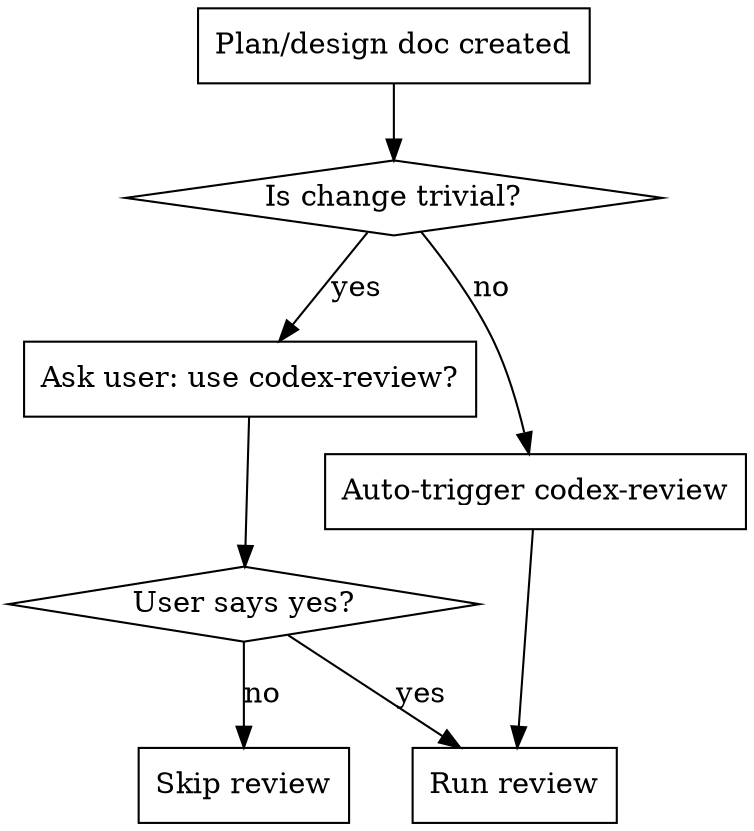
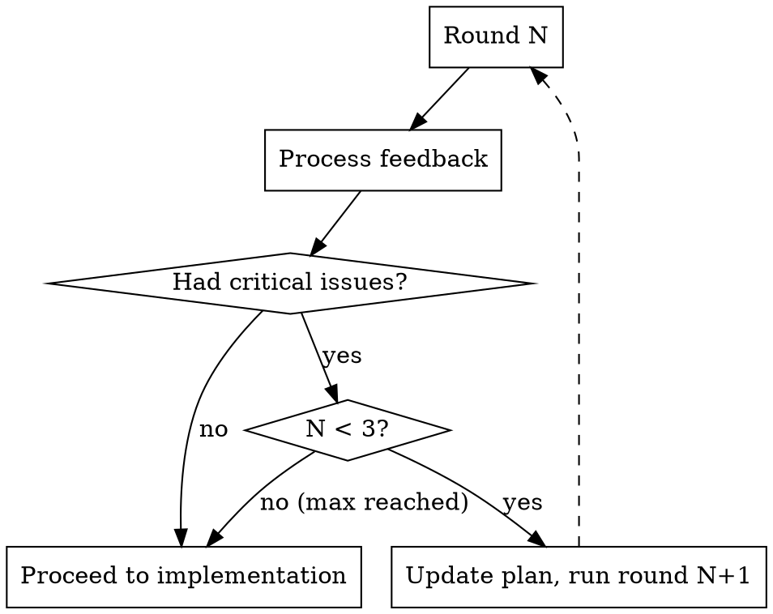
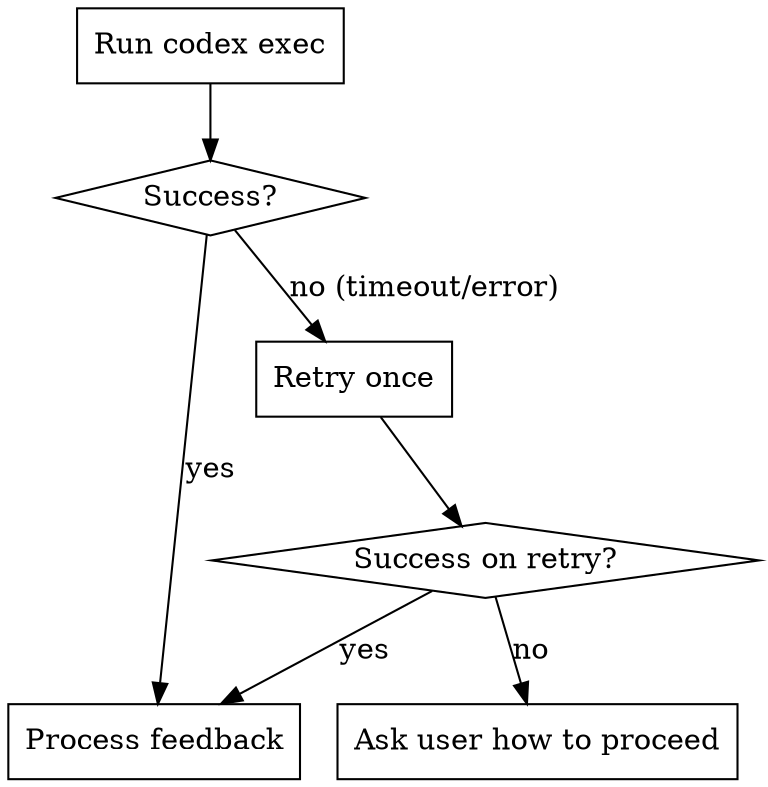

# Codex Review

## Overview

Cross-agent review workflow: After creating a design doc or implementation plan, invoke Codex to review it, then address the feedback before implementation.

**Core principle:** Two agents catch more issues than one. Codex reviews with fresh eyes while Claude addresses feedback.

## When to Use



**Trivial changes:** Single-file edits, typo fixes, config changes, adding a simple function. Ask before reviewing.

**Non-trivial (auto-trigger):** Multi-file changes, new features, architectural decisions, refactors, anything with design choices.

**Also use when:** User explicitly requests codex-review (e.g., "use codex-review", "get Codex feedback").

## Invoking Codex

Run from the **project root directory**:

**CRITICAL: This MUST be a single Bash tool invocation.** Shell state (variables) does not persist between Bash calls, so the timeout detection and codex exec must be in the same command.

```bash
TIMEOUT_CMD=""; if command -v timeout >/dev/null 2>&1; then TIMEOUT_CMD="timeout 600"; elif command -v gtimeout >/dev/null 2>&1; then TIMEOUT_CMD="gtimeout 600"; fi; $TIMEOUT_CMD codex exec -C /absolute/path/to/project/root \
    --sandbox read-only \
    --full-auto \
    --skip-git-repo-check \
    "Read relative/path/to/plan.md, do research on the codebase, and then provide feedback on the plan. Point out any issues, flaws, or concerns with the plan. In your final response, provide only the feedback. Don't offer to do anything else or ask follow-up questions." 2>/dev/null
```

**Parameters:**
- `timeout`/`gtimeout` wrapper: Kill the process after 10 minutes to prevent indefinite hangs. Uses `timeout` on Linux, `gtimeout` on macOS (from `brew install coreutils`), or runs without a timeout if neither is available.
- `-C`: Absolute path to project root
- `--sandbox read-only`: Codex can read but not modify
- `--full-auto`: No interactive prompts
- `--skip-git-repo-check`: Works in any directory
- `2>/dev/null`: Suppress stderr noise

**Capture stdout directly** - do not write feedback to a file.

**CRITICAL: Run in foreground only.** Do NOT run codex exec as a background process (no `&`, no `nohup`, no subshell backgrounding). Always run it synchronously so that the command fully completes and exits before you proceed. Running it in the background can cause the process to linger and produce confusing duplicate output later when it eventually exits.

**Path handling:**
- **Plan inside project:** Use relative path from project root (e.g., `docs/plan.md`)
- **Plan outside project:** Use absolute path (e.g., `/tmp/scratch/plan.md`)
- The `-C` flag always takes the absolute project root path regardless of where the plan file lives

## What Codex Reviews Well (and Doesn't)

**Codex excels at:**
- Checking if plan matches actual codebase structure (file paths, frameworks, patterns)
- Identifying missing dependencies or incompatible libraries
- Spotting architectural mismatches (e.g., Express patterns in a Next.js app)
- Finding references to non-existent code (routes, models, functions)

**Codex may struggle with:**
- Plans referencing external systems Codex can't access (APIs, databases, third-party services)
- Very high-level or abstract plans with few concrete file/code references
- Plans for greenfield projects where there's no existing code to compare against

**If Codex feedback seems shallow:** The plan may lack enough concrete details for meaningful review. Consider adding specific file paths, function names, or code snippets before re-running.

## Processing Feedback

After receiving Codex's feedback, categorize each item:

| Category | Action |
|----------|--------|
| **Critical issues** | Address immediately without asking. These are bugs, security issues, logical flaws, missing error handling, or architectural problems that would cause failures. |
| **Minor concerns** | Present to user and ask which to address. These are style suggestions, optional improvements, alternative approaches, or "nice to have" items. |

**Presenting minor concerns:**

Handle each minor concern individually using `AskUserQuestion`. For each concern, present multiple ways to address it so the user can pick the best approach.

Call `AskUserQuestion` once per minor concern with options representing different ways to resolve it:

```
AskUserQuestion:
  question: "Codex suggests: [concern summary]. How should I address this?"
  header: "[short label]"
  options:
    - label: "[Approach A]", description: "[what this approach does]"
    - label: "[Approach B]", description: "[what this approach does]"
    - label: "Skip this", description: "Don't address this concern"
  multiSelect: false
```

**Guidelines:**
- Each concern gets its own `AskUserQuestion` call — do not batch multiple concerns into one question
- Always include a "Skip this" option so the user can dismiss concerns they don't care about
- Present 2-3 concrete resolution approaches per concern, plus the skip option
- If there are many minor concerns (5+), you may batch multiple `AskUserQuestion` calls in parallel (up to 4 per message) to avoid excessive back-and-forth

## Review Rounds

**Auto-continue on critical issues, capped at 3 rounds.**



**Rules:**
- After each round, if any **critical issues** were found and addressed, automatically run another round to verify the fixes
- If a round produces only minor concerns (or no feedback), stop — no further rounds needed
- **Maximum 3 rounds total.** If round 3 still has critical issues, proceed to implementation anyway and note the unresolved concerns
- The user can still request a specific number of rounds (e.g., "do 2 rounds"), which overrides the auto-continue logic but is still capped at 3

After each round:
1. Address critical issues and update the plan/design doc
2. Present minor concerns to the user (per the feedback processing rules above)
3. If critical issues were addressed and rounds remain, invoke Codex again on the updated doc
4. After final round, proceed to implementation

## Error Handling



**On persistent failure, ask:**
```
Codex review failed after retry. How would you like to proceed?
1. Skip review and continue to implementation
2. Try again
3. I'll review the plan manually
```

## Common Mistakes

| Mistake | Fix |
|---------|-----|
| Splitting timeout detection and codex exec into separate Bash calls | Everything must be ONE Bash invocation — variables don't persist between calls |
| Running codex from wrong directory | Always use `-C /absolute/path/to/project/root` |
| Running codex in background | Always run synchronously (no `&`). Background processes cause duplicate output later |
| Codex hangs indefinitely | The `timeout`/`gtimeout` wrapper kills it after 10 minutes |
| `timeout` not found (exit code 127) on macOS | Use `gtimeout` from `brew install coreutils`, or omit timeout if neither is available |
| Writing feedback to file | Capture stdout directly, don't create feedback files |
| Running extra rounds when only minor concerns remain | Only auto-continue if critical issues were found |
| Exceeding 3 rounds | Cap at 3 rounds max, even if critical issues persist |
| Addressing all feedback equally | Categorize: critical = auto-fix, minor = ask user |
| Forgetting to update plan between rounds | Always update the doc before next round |
| Using relative path for plan outside project | Use absolute path for files not in project root |
| Running review on vague/abstract plans | Ensure plan has concrete file paths and code references |

## Quick Reference

```
# Review flow (auto-continues on critical issues, max 3 rounds)
[Create plan] → codex-review round 1 → address feedback →
  critical issues found? → yes → update plan → round 2 → ...
  no critical issues?    → proceed to implementation

# Feedback handling
Critical issues  → Address immediately, triggers another round
Minor concerns   → AskUserQuestion per concern with resolution options
```
