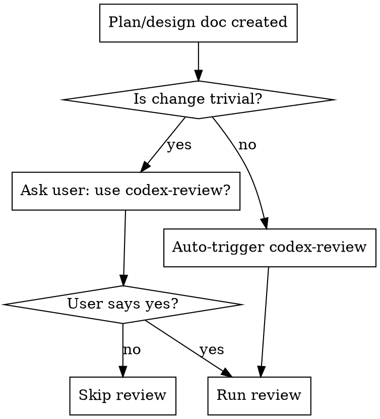
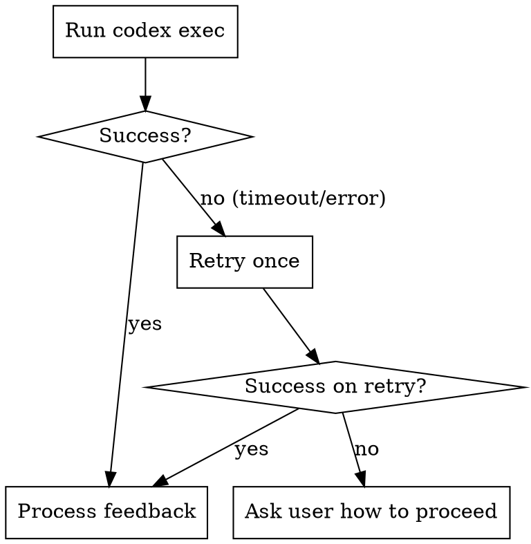

# Codex Review

## Overview

Cross-agent review workflow: After creating a design doc or implementation plan, invoke Codex to review it, then address the feedback before implementation.

**Core principle:** Two agents catch more issues than one. Codex reviews with fresh eyes while Claude addresses feedback.

## When to Use



**Trivial changes:** Single-file edits, typo fixes, config changes, adding a simple function. Ask before reviewing.

**Non-trivial (auto-trigger):** Multi-file changes, new features, architectural decisions, refactors, anything with design choices.

**Also use when:** User explicitly requests codex-review (e.g., "use codex-review", "get Codex feedback").

## Invoking Codex

Run from the **project root directory**:

```bash
# Determine the timeout command (macOS doesn't have `timeout` by default)
if command -v timeout >/dev/null 2>&1; then
  TIMEOUT_CMD="timeout 600"
elif command -v gtimeout >/dev/null 2>&1; then
  TIMEOUT_CMD="gtimeout 600"
else
  TIMEOUT_CMD=""
fi

$TIMEOUT_CMD codex exec -C /absolute/path/to/project/root \
    --sandbox read-only \
    --full-auto \
    --skip-git-repo-check \
    "Read relative/path/to/plan.md, do research on the codebase, and then provide feedback on the plan. Point out any issues, flaws, or concerns with the plan. In your final response, provide only the feedback. Don't offer to do anything else or ask follow-up questions." 2>/dev/null
```

**Parameters:**
- `timeout`/`gtimeout` wrapper: Kill the process after 10 minutes to prevent indefinite hangs. Uses `timeout` on Linux, `gtimeout` on macOS (from `brew install coreutils`), or runs without a timeout if neither is available.
- `-C`: Absolute path to project root
- `--sandbox read-only`: Codex can read but not modify
- `--full-auto`: No interactive prompts
- `--skip-git-repo-check`: Works in any directory
- `2>/dev/null`: Suppress stderr noise

**Capture stdout directly** - do not write feedback to a file.

**CRITICAL: Run in foreground only.** Do NOT run codex exec as a background process (no `&`, no `nohup`, no subshell backgrounding). Always run it synchronously so that the command fully completes and exits before you proceed. Running it in the background can cause the process to linger and produce confusing duplicate output later when it eventually exits.

**Path handling:**
- **Plan inside project:** Use relative path from project root (e.g., `docs/plan.md`)
- **Plan outside project:** Use absolute path (e.g., `/tmp/scratch/plan.md`)
- The `-C` flag always takes the absolute project root path regardless of where the plan file lives

## What Codex Reviews Well (and Doesn't)

**Codex excels at:**
- Checking if plan matches actual codebase structure (file paths, frameworks, patterns)
- Identifying missing dependencies or incompatible libraries
- Spotting architectural mismatches (e.g., Express patterns in a Next.js app)
- Finding references to non-existent code (routes, models, functions)

**Codex may struggle with:**
- Plans referencing external systems Codex can't access (APIs, databases, third-party services)
- Very high-level or abstract plans with few concrete file/code references
- Plans for greenfield projects where there's no existing code to compare against

**If Codex feedback seems shallow:** The plan may lack enough concrete details for meaningful review. Consider adding specific file paths, function names, or code snippets before re-running.

## Processing Feedback

After receiving Codex's feedback, categorize each item:

| Category | Action |
|----------|--------|
| **Critical issues** | Address immediately without asking. These are bugs, security issues, logical flaws, missing error handling, or architectural problems that would cause failures. |
| **Minor concerns** | Present to user and ask which to address. These are style suggestions, optional improvements, alternative approaches, or "nice to have" items. |

**Presenting minor concerns:**

Use the `ask_user_input` tool (multi_select) to let the user pick which minor concerns to address. Each option should be a short summary of the concern. This avoids requiring the user to type out responses manually.

Example usage:
```
ask_user_input with type="multi_select":
  question: "Codex raised these additional concerns. Which should I address?"
  options:
    - "[Concern 1 summary]"
    - "[Concern 2 summary]"
    - "[Concern 3 summary]"
    - "None of these"
```

If there are more than 4 minor concerns, group related ones together or split across multiple questions (the tool supports up to 3 questions with up to 4 options each). If concerns don't fit in the tool's constraints, fall back to listing them in text and asking the user to reply.

## Review Rounds

**Default:** 1 round

**User can specify more:** "use codex-review with 2 rounds", "do 3 review rounds"

Do NOT ask after each round whether to continue. Complete all requested rounds, then proceed.

After each round:
1. Update the plan/design doc with changes
2. If more rounds remain, invoke Codex again on the updated doc
3. After final round, proceed to implementation

## Error Handling



**On persistent failure, ask:**
```
Codex review failed after retry. How would you like to proceed?
1. Skip review and continue to implementation
2. Try again
3. I'll review the plan manually
```

## Common Mistakes

| Mistake | Fix |
|---------|-----|
| Running codex from wrong directory | Always use `-C /absolute/path/to/project/root` |
| Running codex in background | Always run synchronously (no `&`). Background processes cause duplicate output later |
| Codex hangs indefinitely | The `timeout`/`gtimeout` wrapper kills it after 10 minutes |
| `timeout` not found (exit code 127) on macOS | Use `gtimeout` from `brew install coreutils`, or omit timeout if neither is available |
| Writing feedback to file | Capture stdout directly, don't create feedback files |
| Asking after each round | Complete all requested rounds without prompting |
| Addressing all feedback equally | Categorize: critical = auto-fix, minor = ask user |
| Forgetting to update plan between rounds | Always update the doc before next round |
| Using relative path for plan outside project | Use absolute path for files not in project root |
| Running review on vague/abstract plans | Ensure plan has concrete file paths and code references |

## Quick Reference

```
# Single round (default)
[Create plan] → codex-review → address feedback → implement

# Multiple rounds
[Create plan] → codex-review round 1 → update plan →
              → codex-review round 2 → update plan → implement

# Feedback handling
Critical issues  → Address immediately
Minor concerns   → Ask user which to address
```
